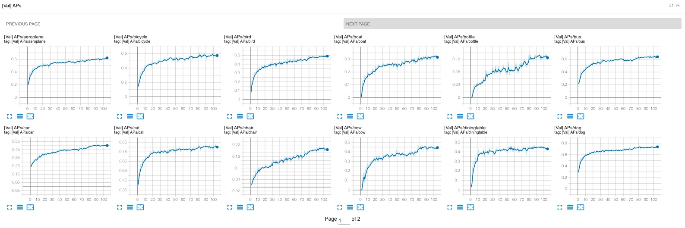
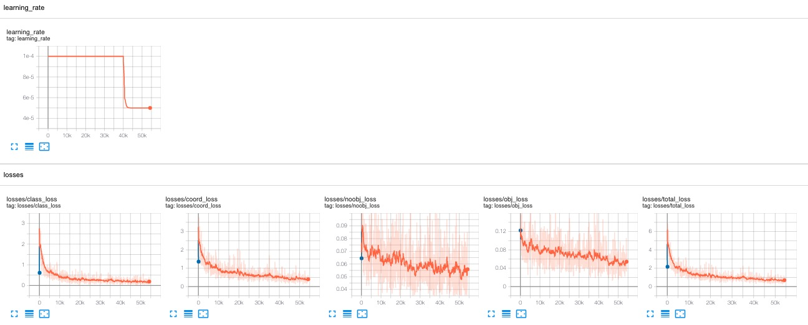
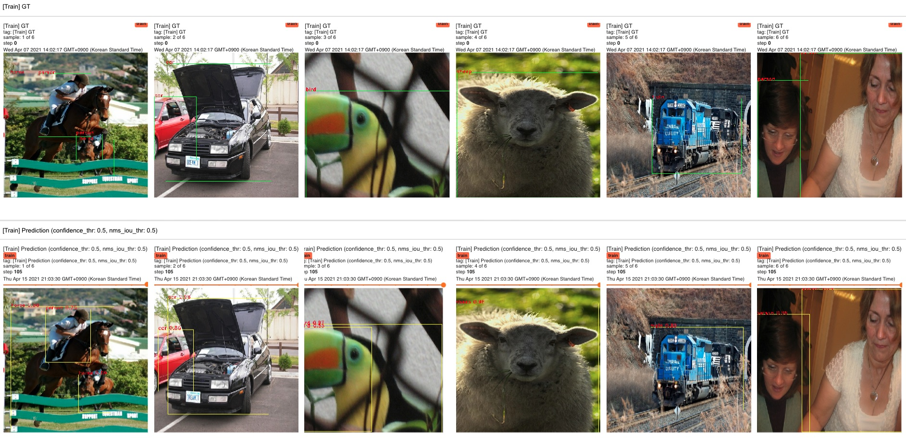
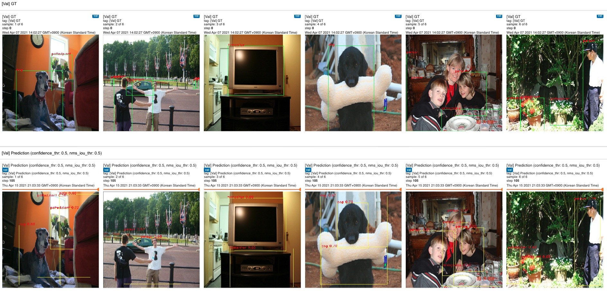

# YOLOv1 with Tensorflow 2


For ease of implementation, i have not implemented exactly the same as paper.  
The things presented below are implemented differently from the paper.

- Backbone network. (Used **Xception** instead of network mentioned in the paper.)

- Learning rate schedule (Used `tf.keras.optimizers.schedules.ExponentialDecay`)

- Data augmentations

- Hyper parameters

- And so on . . .

<br><br>

## Preview

### Tensorboard

<div align="center">
<a href="./preview/tb_scalars_val_aps.jpeg">

</a>
<a href="./preview/tb_scalars_lr_losses.jpeg">

</a>
</div>

<div align="center">
<a href="./preview/tb_imgs_train.jpeg">

</a>
<a href="./preview/tb_imgs_val.jpeg">

</a>
</div>

<br><br>

## Build Environment with Docker

### Build Docker Image

```bash
$ docker build -t ${NAME}:${TAG} .
```

### Create a Container

```bash
$ docker run -d -it --gpus all --shm-size=${PROPER_VALUE} ${NAME}:${TAG} /bin/bash
```

<br><br>

## Pascal VOC Dataset ([Link](http://host.robots.ox.ac.uk/pascal/VOC/))

> Pascal VOC Dataset with [TFDS](https://www.tensorflow.org/datasets/overview)

### Number of Images

|                 | Train | Validation | Test                   |
|-----------------|-------|------------|------------------------|
| Pascal VOC 2007 | 2501  | 2510       | 4952 (Used Validation) |
| Pascal VOC 2012 | 5717  | 5823       | 10991 (No labels)      |

- Training Set: VOC2007 trainval + VOC2012 trainval
- Validation Set: VOC2007 test

<br>

### Training Script

> Path: [./voc_scripts/train_voc.py](./voc_scripts/train_voc.py)

```bash
$ python train_voc.py
```

**Options**  

Default option values are [./configs/configs.py](./configs/configs.py).  
If the options are given, the default config values are overridden.  

- `--epochs`: Number of training epochs
- `--init_lr`: Initial learning rate
- `--lr_decay_rate`: Learning rate decay rate
- `--lr_decay_steps`: Learning rate decay steps
- `--batch_size`: Training batch size
- `--val_step`: Validation interval during training
- `--tb_img_max_outputs `: Number of visualized prediction images in tensorboard
- `--train_ds_sample_ratio`: Training dataset sampling ratio
- `--val_ds_sample_ratio`: Validation dataset sampling ratio

<br>

### Evaluation Script

> Path: [./voc_scripts/eval_voc.py](./voc_scripts/eval_voc.py)

Evaluation pretrained model with VOC2007 Test Dataset

```bash
$ python eval_voc.py
```

**Options**  

- `--batch_size`: Evaluation batch size (Default: batch_size of [./configs/configs.py](./configs/configs.py).)
- `--pb_dir`: Save pb directory path (Default: `./ckpts/voc_ckpts/yolo_voc_448x448`)

<br><br>

## Citation

**You Only Look Once: Unified, Real-Time Object Detection** \<[arxiv link](https://arxiv.org/abs/1506.02640)\>

```
@misc{redmon2016look,
      title={You Only Look Once: Unified, Real-Time Object Detection}, 
      author={Joseph Redmon and Santosh Divvala and Ross Girshick and Ali Farhadi},
      year={2016},
      eprint={1506.02640},
      archivePrefix={arXiv},
      primaryClass={cs.CV}
}
```
